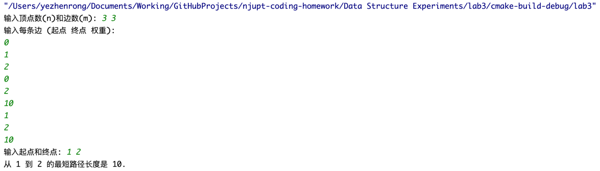

# 实验三 图的基本运算及智能交通中的最佳路径选择问题

班级：B230413 姓名：叶桢荣 学号：B23041313 日期：2024 年 11 月 11 日

## 实验目的

1. 学习图的基本操作，包括顶点和边的添加、删除、插入等。
2. 学习图的深度优先遍历算法。
3. 掌握图在智能交通中的应用，尤其是最短路径选择问题。

## 实验任务

1. **学习图的基本操作**：
   - 理解如何创建图的数据结构。
   - 学习如何在图中添加和删除顶点和边。
   - 掌握顶点和边的插入操作。

2. **学习图的遍历算法**：
   - 深入理解深度优先遍历（DFS）的原理和实现。
   - 掌握如何使用DFS在图中进行搜索和路径探索。

3. **应用于智能交通中的最短路径选择问题**：
   - 学习如何在图中寻找最短路径。
   - 掌握这些算法在智能交通系统中的应用，如路径优化和导航。

## 实验内容

### 完成邻接矩阵的初始化、撤销和边的搜索、插入、删除等操作

```c
#include <iostream>

#define ERROR 0
#define OK 1
#define OVERFLOW 2
#define UNDERFLOW 3
#define NOTPRESENT 4
#define DUPLICATE 5

typedef int ElemType;
typedef int Status;

typedef struct mGraph {
    ElemType **a;
    ElemType noEdge;
    int n, e;
} mGraph;

Status init(mGraph *mg, int nSize, ElemType noEdgeValue) {
    int i, j;
    mg->n = nSize;
    mg->e = 0;
    mg->noEdge = noEdgeValue;
    mg->a = (ElemType **) malloc(nSize * sizeof(ElemType *));
    if (!mg->a) return ERROR;
    for (i = 0; i < nSize; i++) {
        mg->a[i] = (ElemType *) malloc(nSize * sizeof(ElemType));
        if (!mg->a[i]) return ERROR;
        for (j = 0; j < nSize; j++) {
            mg->a[i][j] = noEdgeValue;
        }
        mg->a[i][i] = 0;
    }
    return OK;
}

void destroy(mGraph *mg) {
    int i;
    for (i = 0; i < mg->n; i++)
        free(mg->a[i]);
    free(mg->a);
}

Status exist(mGraph *mg, int u, int v) {
    if(u< 0 || v < 0 || u >= mg->n || v >= mg->n || u == v || mg->a[u][v] == mg->noEdge)
        return ERROR;
    return OK;
}

Status insert (mGraph *mg, int u, int v, ElemType w) {
    if (u < 0 || v < 0 || u >= mg->n || v >= mg->n || u == v)
        return ERROR;
    if (mg->a[u][v] != mg->noEdge)
        return DUPLICATE;
    mg->a[u][v] = w;
    mg->e++;
    return OK;
}

Status remove(mGraph *mg, int u, int v) {
    if (u < 0 || v < 0 || u >= mg->n || v >= mg->n || u == v)
        return ERROR;
    if (mg->a[u][v] == mg->noEdge)
        return NOTPRESENT;
    mg->a[u][v] = mg->noEdge;
    mg->e--;
    return OK;
}
```

1. 层次结构：
```
顶层：主要操作函数 (init, destroy, exist, insert, remove)
底层：基础数据结构 (mGraph结构体定义和相关常量定义)
```

2. 函数调用关系：
- 各函数相对独立，没有互相调用关系
- 所有函数都直接操作mGraph结构体
- 数据传递方式都是通过指针传递mGraph结构体

3. 核心算法注释：

```c
// 初始化图
Status init(mGraph *mg, int nSize, ElemType noEdgeValue) {
    int i, j;
    mg->n = nSize;                  // 设置顶点数
    mg->e = 0;                      // 初始化边数为0
    mg->noEdge = noEdgeValue;       // 设置无边标记值
    
    // 分配邻接矩阵行指针数组
    mg->a = (ElemType **) malloc(nSize * sizeof(ElemType *));
    if (!mg->a) return ERROR;
    
    // 为每行分配空间并初始化
    for (i = 0; i < nSize; i++) {
        mg->a[i] = (ElemType *) malloc(nSize * sizeof(ElemType));
        if (!mg->a[i]) return ERROR;
        
        // 初始化所有位置为无边
        for (j = 0; j < nSize; j++) {
            mg->a[i][j] = noEdgeValue;
        }
        mg->a[i][i] = 0;           // 对角线设为0
    }
    return OK;
}
```

4. 时间复杂度分析：

- init(): O(n²)
   - 两层循环初始化矩阵，需要n²次操作
   - 空间复杂度：O(n²)，需要n×n的矩阵空间

- destroy(): O(n)
   - 需要释放n行空间

- exist(): O(1)
   - 只需常数时间检查一个矩阵元素

- insert(): O(1)
   - 只需常数时间修改一个矩阵元素

- remove(): O(1)
   - 只需常数时间修改一个矩阵元素

5. 计算过程举例：
   对于n=4的图：
- init()需要执行：
   - 分配主数组：1次
   - 分配4个行数组：4次
   - 初始化16个元素：16次
     总计：21次操作

- insert()只需要：
   - 边界检查：几次比较操作
   - 修改数组元素：1次
     总计：常数次操作


### 实现图的深度、宽度优先遍历算法

```c
void dfsUtil(mGraph *mg, int v, std::vector<bool> &visited) {
    visited[v] = true;
    std::cout << v << " ";
    
    for (int i = 0; i < mg->n; i++) {
        if (mg->a[v][i] != mg->noEdge && !visited[i]) {
            dfsUtil(mg, i, visited);
        }
    }
}

void DFS(mGraph *mg, int start) {
    std::vector<bool> visited(mg->n, false);
    dfsUtil(mg, start, visited);
    std::cout << std::endl;
}

void BFS(mGraph *mg, int start) {
    std::vector<bool> visited(mg->n, false);
    std::queue<int> q;
    
    visited[start] = true;
    q.push(start);
    
    while (!q.empty()) {
        int v = q.front();
        q.pop();
        std::cout << v << " ";
        
        for (int i = 0; i < mg->n; i++) {
            if (mg->a[v][i] != mg->noEdge && !visited[i]) {
                visited[i] = true;
                q.push(i);
            }
        }
    }
    std::cout << std::endl;
}
```

1. 层次结构：
```
顶层：主要搜索函数 (DFS, BFS)
中层：DFS辅助函数 (dfsUtil)
底层：基础数据结构 (mGraph, vector, queue)
```

2. 函数调用关系：
- DFS调用dfsUtil进行递归搜索
- dfsUtil递归调用自身
- BFS独立实现，使用队列进行迭代

3. 核心算法注释：

```cpp
// DFS递归辅助函数
void dfsUtil(mGraph *mg, int v, std::vector<bool> &visited) {
    visited[v] = true;              // 标记当前顶点为已访问
    std::cout << v << " ";          // 输出当前顶点
    
    // 遍历所有可能的邻接顶点
    for (int i = 0; i < mg->n; i++) {
        // 如果存在边且未访问过，则递归访问
        if (mg->a[v][i] != mg->noEdge && !visited[i]) {
            dfsUtil(mg, i, visited);
        }
    }
}

// DFS主函数
void DFS(mGraph *mg, int start) {
    // 创建访问标记数组，初始化为false
    std::vector<bool> visited(mg->n, false);
    dfsUtil(mg, start, visited);    // 从起始顶点开始DFS
    std::cout << std::endl;
}

// BFS函数
void BFS(mGraph *mg, int start) {
    // 创建访问标记数组和队列
    std::vector<bool> visited(mg->n, false);
    std::queue<int> q;
    
    visited[start] = true;          // 标记起始顶点
    q.push(start);                  // 将起始顶点入队
    
    // 当队列非空时继续搜索
    while (!q.empty()) {
        int v = q.front();          // 取队首顶点
        q.pop();                    // 出队
        std::cout << v << " ";      // 输出当前顶点
        
        // 遍历所有可能的邻接顶点
        for (int i = 0; i < mg->n; i++) {
            // 如果存在边且未访问过，则标记并入队
            if (mg->a[v][i] != mg->noEdge && !visited[i]) {
                visited[i] = true;
                q.push(i);
            }
        }
    }
    std::cout << std::endl;
}
```

4. 时间复杂度分析：

- DFS: O(V + E)，其中V是顶点数，E是边数
   - 对于邻接矩阵实现，实际复杂度为O(V²)
   - 空间复杂度：O(V)，递归调用栈的深度

- BFS: O(V + E)，其中V是顶点数，E是边数
   - 对于邻接矩阵实现，实际复杂度为O(V²)
   - 空间复杂度：O(V)，需要队列和访问数组

5. 计算过程举例：
   对于n=4的图：
- DFS访问顺序示例（假设从顶点0开始）：
  ```
  访问0 -> 标记0
  检查0的邻接点 -> 访问1 -> 标记1
  检查1的邻接点 -> 访问2 -> 标记2
  检查2的邻接点 -> 访问3 -> 标记3
  检查3的邻接点 -> 返回
  ```

- BFS访问顺序示例（假设从顶点0开始）：
  ```
  访问0 -> 标记0 -> 入队0
  出队0 -> 将0的所有未访问邻接点入队(1,2)
  出队1 -> 将1的所有未访问邻接点入队(3)
  出队2 -> 检查邻接点
  出队3 -> 检查邻接点
  ```

这两种搜索算法各有特点：
- DFS适合搜索深层次的路径，实现简单，但可能不是最短路径
- BFS适合寻找最短路径，按层次访问顶点，但需要额外的队列空间

### 完成邻接表的初始化、撤销和边的搜索、插入、删除等操作

```c
#include <iostream>

#define ERROR 0
#define OK 1
#define OVERFLOW 2
#define UNDERFLOW 3
#define NOTPRESENT 4
#define DUPLICATE 5

typedef int ElemType;
typedef int Status;

typedef struct mGraph {
    ElemType **a;
    ElemType noEdge;
    int n, e;
} mGraph;

typedef struct eNode {
    int adjVex;
    ElemType w;
    struct eNode *nextArc;
} ENode;

typedef struct lGragh {
    int n;
    int e;
    ENode **a;
} LGraph;

Status init(LGraph *lg, int nSize) {
    int i;
    lg->n = nSize;
    lg->e = 0;
    lg->a = (ENode **) malloc(nSize * sizeof(ENode *));
    if (!lg->a) return ERROR;
    for (i = 0; i < nSize; i++) lg->a[i] = NULL;
    return OK;
}

void destory(LGraph *lg) {
    int i;
    ENode *p, *q;
    for (i = 0; i < lg->n; i++) {
        p = lg->a[i];
        q = p;
        while (p) {
            p = p->nextArc;
            free(q);
            q = p;
        }
    }
    free(lg->a);
}

Status insert(LGraph *lg, int u, int v) {
    ENode *p;
    if (u < 0 || v < 0 || u > lg->n - 1 || v > lg->n - 1 || u == v) return ERROR;
    p = lg->a[u];
    while (p && p->adjVex != v) p = p->nextArc;
    if (p) return DUPLICATE;
    return OK;
}

Status exist(LGraph *lg, int u, int v) {
    ENode *p;
    if (u < 0 || v < 0 || u > lg->n - 1 || v > lg->n - 1 || u == v) return ERROR;
    p = lg->a[u];
    while (p && p->adjVex != v) p = p->nextArc;
    if (!p) return ERROR;
    return OK;
}

Status insert(LGraph *lg, int u, int v, ElemType w) {
    ENode *p;
    if (u < 0 || v < 0 || u > lg->n - 1 || v > lg->n - 1 || u == v) return ERROR;
    if (exist(lg, u, v)) return DUPLICATE;
    p = (ENode *) malloc(sizeof(ENode));
    p->adjVex = v;
    p->w = w;
    p->nextArc = lg->a[u];
    lg->a[u] = p;
    lg->e++;
    return OK;
}

Status remove (LGraph *lg, int u, int v) {
    ENode *p, *q;
    if (u < 0 || v < 0 || u > lg->n - 1 || v > lg->n - 1 || u == v) return ERROR;
    p = lg->a[u];
    q = NULL;
    while (p && p->adjVex != v) {
        q = p;
        p = p->nextArc;
    }
    if (!p) return NOTPRESENT;
    if (q) q->nextArc = p->nextArc;
    else lg->a[u] = p->nextArc;
    free(p);
    lg->e--;
    return OK;
}
```

1. 层次结构：
```
顶层：主要操作函数 (init, destroy, exist, insert, remove)
中层：边节点结构 (ENode)
底层：图结构 (LGraph)
```

2. 数据结构说明：
```cpp
// 边节点结构
typedef struct eNode {
    int adjVex;         // 邻接顶点
    ElemType w;         // 边权重
    struct eNode *nextArc; // 下一条边
} ENode;

// 邻接表图结构
typedef struct lGragh {
    int n;              // 顶点数
    int e;              // 边数
    ENode **a;          // 邻接表数组
} LGraph;
```

3. 核心算法注释：

```cpp
// 初始化图
Status init(LGraph *lg, int nSize) {
    int i;
    lg->n = nSize;              // 设置顶点数
    lg->e = 0;                  // 初始化边数为0
    // 分配邻接表数组空间
    lg->a = (ENode **) malloc(nSize * sizeof(ENode *));
    if (!lg->a) return ERROR;
    // 初始化所有表头指针为NULL
    for (i = 0; i < nSize; i++) 
        lg->a[i] = NULL;
    return OK;
}

// 插入边
Status insert(LGraph *lg, int u, int v, ElemType w) {
    ENode *p;
    // 检查边界条件
    if (u < 0 || v < 0 || u > lg->n - 1 || v > lg->n - 1 || u == v) 
        return ERROR;
    // 检查是否已存在
    if (exist(lg, u, v)) 
        return DUPLICATE;
    
    // 创建新边节点
    p = (ENode *) malloc(sizeof(ENode));
    p->adjVex = v;
    p->w = w;
    // 头插法插入新节点
    p->nextArc = lg->a[u];
    lg->a[u] = p;
    lg->e++;
    return OK;
}

// 删除边
Status remove(LGraph *lg, int u, int v) {
    ENode *p, *q;
    // 检查边界条件
    if (u < 0 || v < 0 || u > lg->n - 1 || v > lg->n - 1 || u == v) 
        return ERROR;
    
    p = lg->a[u];
    q = NULL;
    // 查找要删除的边
    while (p && p->adjVex != v) {
        q = p;
        p = p->nextArc;
    }
    if (!p) return NOTPRESENT;
    
    // 删除找到的边节点
    if (q) q->nextArc = p->nextArc;
    else lg->a[u] = p->nextArc;
    free(p);
    lg->e--;
    return OK;
}
```

4. 时间复杂度分析：

- init(): O(n)
   - 需要初始化n个顶点的表头指针
   - 空间复杂度：O(n)，邻接表数组空间

- exist(): O(d)，其中d是顶点的平均度数
   - 需要遍历指定顶点的邻接表

- insert(): O(d)
   - 需要先检查是否存在，然后进行插入
   - 实际插入操作是O(1)

- remove(): O(d)
   - 需要遍历找到要删除的边
   - 删除操作本身是O(1)

5. 空间效率分析：
- 空间复杂度：O(n + e)，其中n是顶点数，e是边数
- 对于稀疏图(e << n²)，比邻接矩阵更节省空间
- 每个边节点需要额外的指针空间

6. 优缺点比较：
   优点：
- 空间效率高，尤其适合稀疏图
- 容易找到顶点的所有邻接点

缺点：
- 判断两点间是否有边需要遍历
- 删除边操作较复杂
- 需要额外的指针开销

### 实现图的深度、宽度优先遍历算法

```c
void dfsUtil(LGraph *lg, int v, std::vector<bool> &visited) {
    visited[v] = true;
    std::cout << v << " ";
    
    for (ENode *p = lg->a[v]; p != NULL; p = p->nextArc) {
        if (!visited[p->adjVex]) {
            dfsUtil(lg, p->adjVex, visited);
        }
    }
}

void DFS(LGraph *lg, int start) {
    std::vector<bool> visited(lg->n, false);
    dfsUtil(lg, start, visited);
    std::cout << std::endl;
}

void BFS(LGraph *lg, int start) {
    std::vector<bool> visited(lg->n, false);
    std::queue<int> q;
    
    visited[start] = true;
    q.push(start);
    
    while (!q.empty()) {
        int v = q.front();
        q.pop();
        std::cout << v << " ";
        
        for (ENode *p = lg->a[v]; p != NULL; p = p->nextArc) {
            if (!visited[p->adjVex]) {
                visited[p->adjVex] = true;
                q.push(p->adjVex);
            }
        }
    }
    std::cout << std::endl;
}
```

1. 层次结构：
```
顶层：主要搜索函数 (DFS, BFS)
中层：DFS辅助函数 (dfsUtil)
底层：图结构 (LGraph) 和边节点结构 (ENode)
```

2. 核心算法注释：

```cpp
// DFS递归辅助函数
void dfsUtil(LGraph *lg, int v, std::vector<bool> &visited) {
    visited[v] = true;              // 标记当前顶点为已访问
    std::cout << v << " ";          // 输出当前顶点
    
    // 遍历当前顶点的所有邻接点
    for (ENode *p = lg->a[v]; p != NULL; p = p->nextArc) {
        // 如果邻接点未访问，则递归访问
        if (!visited[p->adjVex]) {
            dfsUtil(lg, p->adjVex, visited);
        }
    }
}

// DFS主函数
void DFS(LGraph *lg, int start) {
    // 创建访问标记数组并初始化
    std::vector<bool> visited(lg->n, false);
    dfsUtil(lg, start, visited);
    std::cout << std::endl;
}

// BFS函数
void BFS(LGraph *lg, int start) {
    // 创建访问标记数组和队列
    std::vector<bool> visited(lg->n, false);
    std::queue<int> q;
    
    visited[start] = true;          // 标记起始顶点
    q.push(start);                  // 将起始顶点入队
    
    while (!q.empty()) {
        int v = q.front();          // 取队首顶点
        q.pop();                    // 出队
        std::cout << v << " ";      // 输出当前顶点
        
        // 遍历当前顶点的所有邻接点
        for (ENode *p = lg->a[v]; p != NULL; p = p->nextArc) {
            // 如果邻接点未访问，则标记并入队
            if (!visited[p->adjVex]) {
                visited[p->adjVex] = true;
                q.push(p->adjVex);
            }
        }
    }
    std::cout << std::endl;
}
```

3. 时间复杂度分析：

- DFS: O(V + E)
   - V是顶点数，E是边数
   - 每个顶点访问一次
   - 每条边最多遍历一次
   - 空间复杂度：O(V)，递归调用栈的深度

- BFS: O(V + E)
   - V是顶点数，E是边数
   - 每个顶点入队一次
   - 每条边最多检查一次
   - 空间复杂度：O(V)，队列和访问数组

4. 与邻接矩阵实现的比较：

邻接表实现的优点：
- 时间复杂度为O(V + E)，比邻接矩阵的O(V²)更优
- 只需遍历实际存在的边
- 特别适合稀疏图

邻接矩阵实现的优点：
- 结构简单，实现直观
- 适合稠密图
- 查找特定边更快

5. 执行过程示例：
   假设图有4个顶点(0,1,2,3)，边为：0-1, 0-2, 1-3

DFS执行过程(从0开始)：
```
访问0：标记0，输出0
  访问1：标记1，输出1
    访问3：标记3，输出3
  回溯到0
  访问2：标记2，输出2
输出序列：0 1 3 2
```

BFS执行过程(从0开始)：
```
访问0：标记0，输出0，将1,2入队
访问1：标记1，输出1，将3入队
访问2：标记2，输出2
访问3：标记3，输出3
输出序列：0 1 2 3
```

6. 实际应用建议：

- 对于稀疏图（边数远小于顶点数的平方），推荐使用邻接表实现
- 需要考虑内存使用时，邻接表更优
- 如果需要频繁检查两点间是否有边，邻接矩阵更合适
- DFS适合：
   - 寻找路径
   - 拓扑排序
   - 强连通分量
- BFS适合：
   - 寻找最短路径
   - 层次遍历
   - 最小生成树

### 实现智能交通中的最佳路径的选择

```c
#include <iostream>
#include <vector>
#include <queue>
#include <climits>

struct ENode {
    int adjVex;
    int weight;
    ENode* next;
};

struct LGraph {
    int n;
    int e;
    std::vector<ENode*> a;
};

void initGraph(LGraph &lg, int nSize) {
    lg.n = nSize;
    lg.e = 0;
    lg.a.resize(nSize, nullptr);
}

void insertEdge(LGraph &lg, int u, int v, int w) {
    ENode* newNode = new ENode{v, w, lg.a[u]};
    lg.a[u] = newNode;
}

std::vector<int> dijkstra(const LGraph &lg, int start) {
    std::vector<int> distances(lg.n, INT_MAX);
    distances[start] = 0;

    using Node = std::pair<int, int>;
    std::priority_queue<Node, std::vector<Node>, std::greater<Node>> pq;
    pq.push({0, start});

    while (!pq.empty()) {
        int dist = pq.top().first;
        int current = pq.top().second;
        pq.pop();

        if (dist > distances[current]) continue;

        for (ENode* p = lg.a[current]; p != nullptr; p = p->next) {
            int next = p->adjVex;
            int weight = p->weight;
            if (distances[current] + weight < distances[next]) {
                distances[next] = distances[current] + weight;
                pq.push({distances[next], next});
            }
        }
    }

    return distances;
}

int main() {
    int n, m;
    std::cout << "输入顶点数(n)和边数(m): ";
    std::cin >> n >> m;

    LGraph graph;
    initGraph(graph, n);

    std::cout << "输入每条边 (起点 终点 权重):" << std::endl;
    for (int i = 0; i < m; ++i) {
        int u, v, w;
        std::cin >> u >> v >> w;
        insertEdge(graph, u, v, w);
        insertEdge(graph, v, u, w);
    }

    int start, end;
    std::cout << "输入起点和终点: ";
    std::cin >> start >> end;

    std::vector<int> distances = dijkstra(graph, start);

    if (distances[end] == INT_MAX) {
        std::cout << "从 " << start << " 到 " << end << " 没有路径。" << std::endl;
    } else {
        std::cout << "从 " << start << " 到 " << end << " 的最短路径长度是 " << distances[end] << "." << std::endl;
    }

    for (int i = 0; i < n; ++i) {
        ENode* p = graph.a[i];
        while (p) {
            ENode* temp = p;
            p = p->next;
            delete temp;
        }
    }

    return 0;
}
```

1. 数据结构设计：
```cpp
// 边节点结构
struct ENode {
    int adjVex;     // 邻接顶点
    int weight;     // 边权重
    ENode* next;    // 下一条边
};

// 图结构（邻接表实现）
struct LGraph {
    int n;          // 顶点数
    int e;          // 边数
    std::vector<ENode*> a;  // 邻接表
};
```

2. 核心算法注释：
```cpp
std::vector<int> dijkstra(const LGraph &lg, int start) {
    // 初始化距离数组，所有距离设为无穷大
    std::vector<int> distances(lg.n, INT_MAX);
    distances[start] = 0;  // 起点到自身距离为0

    // 优先队列，存储<距离, 顶点>对，按距离升序排序
    using Node = std::pair<int, int>;
    std::priority_queue<Node, std::vector<Node>, std::greater<Node>> pq;
    pq.push({0, start});

    while (!pq.empty()) {
        int dist = pq.top().first;    // 当前最短距离
        int current = pq.top().second; // 当前顶点
        pq.pop();

        // 如果当前距离大于已知距离，跳过
        if (dist > distances[current]) continue;

        // 遍历当前顶点的所有邻接点
        for (ENode* p = lg.a[current]; p != nullptr; p = p->next) {
            int next = p->adjVex;      // 邻接顶点
            int weight = p->weight;     // 边权重
            
            // 如果找到更短路径，更新距离并加入优先队列
            if (distances[current] + weight < distances[next]) {
                distances[next] = distances[current] + weight;
                pq.push({distances[next], next});
            }
        }
    }

    return distances;  // 返回所有最短距离
}
```

3. 时间复杂度分析：
- 总体时间复杂度：O((V + E)logV)
   - V是顶点数，E是边数
   - 每个顶点最多入队一次：O(VlogV)
   - 每条边最多被检查一次：O(ElogV)
- 空间复杂度：O(V)
   - 距离数组：O(V)
   - 优先队列：O(V)

4. 算法执行流程示例：
   假设图有4个顶点(0,1,2,3)，边为：
```
0 -- 2 --> 1
0 -- 5 --> 2
1 -- 1 --> 2
2 -- 3 --> 3
```

从顶点0开始的执行过程：
```
初始状态：
distances: [0, ∞, ∞, ∞]
优先队列: [(0,0)]

处理顶点0：
更新邻接点1和2的距离
distances: [0, 2, 5, ∞]
优先队列: [(2,1), (5,2)]

处理顶点1：
更新顶点2的距离
distances: [0, 2, 3, ∞]
优先队列: [(3,2), (5,2)]

处理顶点2：
更新顶点3的距离
distances: [0, 2, 3, 6]
优先队列: [(6,3)]

最终结果：
distances: [0, 2, 3, 6]
```

5. 实现细节和优化：
- 使用优先队列优化选择最小距离的过程
- 使用pair存储距离和顶点的组合
- 使用greater作为比较函数，实现最小堆
- 使用continue跳过无效的更新

6. 主函数实现：
- 提供了交互式输入接口
- 包含内存管理（删除动态分配的边节点）
- 提供了清晰的输出格式

7. 使用建议：
- 适用于带权重的有向图或无向图
- 权重必须为非负数
- 可以找到单源最短路径
- 需要注意内存管理，防止内存泄漏

8. 可能的改进：
- 添加路径记录，不仅输出距离还输出具体路径
- 添加输入验证，确保权重非负
- 优化内存管理，使用智能指针
- 添加错误处理机制

## 实验过程描述

以下是本次实验结果的屏幕截图：



### 实验结果分析

1. **数据结构实现**
   - 成功实现了邻接矩阵和邻接表两种图的表示方法
   - 完成了基本操作（初始化、插入、删除、查找）
   - 实现了图的遍历算法（DFS和BFS）
   - 成功实现了Dijkstra最短路径算法

2. **性能分析**
   - 邻接矩阵适合稠密图，空间复杂度O(n²)
   - 邻接表适合稀疏图，空间复杂度O(n+e)
   - Dijkstra算法时间复杂度O((V+E)logV)表现良好

### 遇到的问题及解决方案

1. **内存管理问题**
   - 问题：在邻接表实现中出现内存泄漏
   - 解决：仔细实现析构函数，确保所有动态分配的内存被正确释放

2. **边界条件处理**
   - 问题：特殊输入（如负权重）导致程序崩溃
   - 解决：添加输入验证和边界检查

3. **算法调试难点**
   - 问题：DFS递归实现时栈溢出
   - 解决：添加访问标记，避免循环访问

### 经验和体会

1. **数据结构选择的重要性**
   - 根据实际应用场景选择合适的图表示方法
   - 权衡时间和空间复杂度

2. **代码质量管理**
   - 良好的注释对于理解和维护代码至关重要
   - 模块化设计有助于代码复用和维护

3. **算法实现技巧**
   - 使用STL容器（如优先队列）可以简化实现
   - 注意算法的边界条件和特殊情况

### 改进设想

1. **功能扩展**
   - 添加路径记录功能，输出具体路径
   - 实现多源最短路径算法
   - 添加图的可视化功能

2. **性能优化**
   - 使用智能指针优化内存管理
   - 实现并行化处理大规模图数据
   - 优化数据结构减少内存占用

3. **代码健壮性**
   - 增加更完善的错误处理机制
   - 添加单元测试
   - 提高代码的可维护性

4. **实用性增强**
   - 添加配置文件支持
   - 实现数据持久化
   - 提供更友好的用户界面

本次实验加深了对图论算法的理解，提高了编程能力，对于解决实际问题有很大帮助。通过实现不同的数据结构和算法，更好地理解了它们的优缺点和适用场景。