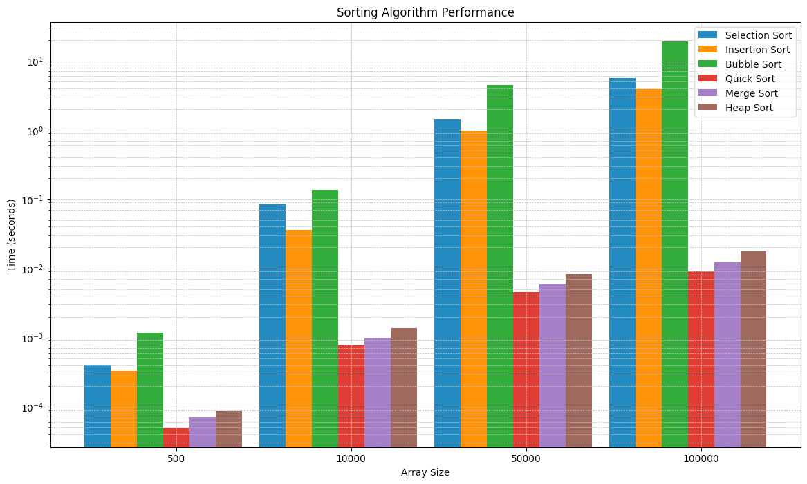

# 实验四 各种内排序算法的实现及性能比较

班级：B230413 姓名：叶桢荣 学号：B23041313 日期：2024 年 12 月 13 日

## 实验目的

1. 掌握各种内排算法的实现方式
2. 学会分析各种内排算法的时间复杂度

## 实验任务

1. 实现并验证多种排序算法：简单选择排序、直接插入排序、冒泡排序、快速排序、两路合并排序和堆排序。
2. 编写程序生成随机数文件，并用不同数量的键值进行排序（500, 10,000, 50,000, 100,000个）。
3. 测量并比较每种排序方法的时间复杂度。
4. 将排序结果导入Excel，并以图表的方式展示。

## 实验内容

### 分别实现顺序表的简单选择排序、直接插入排序、冒泡排序、快速排序、两路合并排序以及堆排序算法

```c
#include <iostream>

typedef int KeyType;
typedef int DataType;
typedef int BOOL;
#define MAXSIZE 500
#define TRUE 1
#define FALSE 0

typedef struct entry {
    KeyType key;
    DataType data;
} Entry;

typedef struct list {
    int n;
    Entry D[MAXSIZE];
} List;

typedef struct maxHeap {
    int n, maxSize;
    Entry D[MAXSIZE];
} MaxHeap;

int findMin(List list, int startIndex) {
    int i, minIndex = startIndex;
    for (i = startIndex + 1; i < list.n; i++) {
        if (list.D[i].key < list.D[minIndex].key) {
            minIndex = i;
        }
    }
    return minIndex;
}

void swap(Entry *D, int i, int j) {
    Entry temp;
    if (i == j) return;
    temp = *(D + i);
    *(D + i) = *(D + j);
    *(D + j) = temp;
}

void selectionSort(List *list) {
    int minIndex, startIndex = 0;
    while (startIndex < list->n - 1) {
        minIndex = findMin(*list, startIndex);
        swap(list->D, startIndex, minIndex);
        startIndex++;
    }
}

void insertSort(List *list) {
    int i, j;
    Entry insertItem;
    for (i = 1; i < list->n; i++) {
        insertItem = list->D[i];
        for (j = i - 1; j >= 0; j--) {
            if (insertItem.key < list->D[j].key) list->D[j + 1] = list->D[j];
            else break;
        }
    }
    list->D[j + 1] = insertItem;
}

void bubbleSort(List *list) {
    int i, j;
    for (i = list->n - 1; i > 0; i--) {
        BOOL isSwap = FALSE;
        for (j = 0; j < i; j++) {
            if (list->D[j].key > list->D[j + 1].key) {
                swap(list->D, j, j + 1);
                isSwap = TRUE;
            }
        }
        if (!isSwap) break;
    }
}

int partition(List *list, int low, int high) {
    int i = low, j = high + 1;
    Entry pivot = list->D[low];
    do {
        do i++; while (i <= high && list->D[i].key < pivot.key);
        do j--; while (list->D[j].key > pivot.key);
        if (i < j) swap(list->D, i, j);
    } while (i < j);
    swap(list->D, low, j);
    return j;
}

void quickSort(List *list, int low, int high) {
    int k;
    if (low < high) {
        k = partition(list, low, high);
        quickSort(list, low, k - 1);
        quickSort(list, k + 1, high);
    }
}

void quickSort(List *list) {
    quickSort(list, 0, list->n - 1);
}

void merge(List *list, Entry *temp, int low, int n1, int n2) {
    int i = low, j = low + n1;
    while (i <= low + n1 - 1 && j <= low + n1 + n2 - 1) {
        if (list->D[i].key < list->D[j].key) *temp++ = list->D[i++];
        else *temp++ = list->D[j++];
    }
    while (i <= low + n1 - 1) *temp++ = list->D[i++];
    while (j <= low + n1 + n2 - 1) *temp++ = list->D[j++];
}

void mergeSort(List *list) {
    Entry temp[MAXSIZE
    ];
    int low, n1, n2, i, size = 1;
    while (size < list->n) {
        low = 0;
        while (low + size < list->n) {
            n1 = size;
            if (low + size * 2 < list->n) n2 = size;
            else n2 = list->n - low - size;
            merge(list, temp, low, n1, n2);
            for (i = 0; i < n1 + n2; i++) list->D[low + i] = temp[i];
            low += n1 + n2;
        }
        size *= 2;
    }
}

void adjustDown(Entry *temp, int i, int n) {
    int largest = i;
    int left = 2 * i + 1;
    int right = 2 * i + 2;

    if (left <= n && temp[left].key > temp[largest].key) {
        largest = left;
    }

    if (right <= n && temp[right].key > temp[largest].key) {
        largest = right;
    }

    if (largest != i) {
        swap(temp, i, largest);
        adjustDown(temp, largest, n);
    }
}


void heapSort(MaxHeap *hp) {
    int i;
    Entry temp;

    for (i = (hp->n / 2) - 1; i >= 0; i--) {
        adjustDown(hp->D, i, hp->n - 1);
    }

    for (i = hp->n - 1; i > 0; i--) {
        swap(hp->D, 0, i);
        adjustDown(hp->D, 0, i - 1);
    }
}  
```

1. 数据结构定义：
```cpp
// 记录结构
struct entry {
    KeyType key;    // 关键字
    DataType data;  // 数据
};

// 顺序表结构
struct list {
    int n;          // 元素个数
    Entry D[MAXSIZE]; // 数据数组
};

// 最大堆结构
struct maxHeap {
    int n, maxSize;  // 当前大小和最大容量
    Entry D[MAXSIZE]; // 堆数组
};
```

2. 各排序算法分析：

#### 选择排序 (Selection Sort)

```cpp
void selectionSort(List *list) {
    int minIndex, startIndex = 0;
    while (startIndex < list->n - 1) {
        // 找到未排序部分最小元素
        minIndex = findMin(*list, startIndex);
        // 交换到已排序部分末尾
        swap(list->D, startIndex, minIndex);
        startIndex++;
    }
}
```
- 时间复杂度：O(n²)
- 空间复杂度：O(1)
- 稳定性：不稳定

#### 插入排序 (Insertion Sort)

```cpp
void insertSort(List *list) {
    int i, j;
    Entry insertItem;
    for (i = 1; i < list->n; i++) {
        insertItem = list->D[i];
        // 寻找插入位置并移动元素
        for (j = i - 1; j >= 0; j--) {
            if (insertItem.key < list->D[j].key) 
                list->D[j + 1] = list->D[j];
            else break;
        }
        list->D[j + 1] = insertItem;
    }
}
```
- 时间复杂度：O(n²)
- 空间复杂度：O(1)
- 稳定性：稳定

#### 冒泡排序 (Bubble Sort)

```cpp
void bubbleSort(List *list) {
    int i, j;
    for (i = list->n - 1; i > 0; i--) {
        BOOL isSwap = FALSE;
        // 一趟冒泡
        for (j = 0; j < i; j++) {
            if (list->D[j].key > list->D[j + 1].key) {
                swap(list->D, j, j + 1);
                isSwap = TRUE;
            }
        }
        // 优化：如果没有交换则已经有序
        if (!isSwap) break;
    }
}
```
- 时间复杂度：O(n²)
- 空间复杂度：O(1)
- 稳定性：稳定

#### 快速排序 (Quick Sort)

```cpp
void quickSort(List *list, int low, int high) {
    if (low < high) {
        // 划分
        int k = partition(list, low, high);
        // 递归排序两部分
        quickSort(list, low, k - 1);
        quickSort(list, k + 1, high);
    }
}
```
- 时间复杂度：平均O(nlogn)，最坏O(n²)
- 空间复杂度：O(logn)
- 稳定性：不稳定

#### 归并排序 (Merge Sort)

```cpp
void mergeSort(List *list) {
    Entry temp[MAXSIZE];
    int size = 1;
    while (size < list->n) {
        // 归并大小为size的相邻子序列
        low = 0;
        while (low + size < list->n) {
            merge(list, temp, low, n1, n2);
            low += n1 + n2;
        }
        size *= 2;
    }
}
```
- 时间复杂度：O(nlogn)
- 空间复杂度：O(n)
- 稳定性：稳定

#### 堆排序 (Heap Sort)

```cpp
void heapSort(MaxHeap *hp) {
    // 建立最大堆
    for (i = (hp->n / 2) - 1; i >= 0; i--) {
        adjustDown(hp->D, i, hp->n - 1);
    }
    // 逐个取出最大值
    for (i = hp->n - 1; i > 0; i--) {
        swap(hp->D, 0, i);
        adjustDown(hp->D, 0, i - 1);
    }
}
```
- 时间复杂度：O(nlogn)
- 空间复杂度：O(1)
- 稳定性：不稳定

3. 算法比较：

| 排序算法 | 平均时间复杂度 | 最坏时间复杂度 | 空间复杂度 | 稳定性 |
|---------|--------------|--------------|-----------|--------|
| 选择排序 | O(n²)        | O(n²)        | O(1)      | 不稳定  |
| 插入排序 | O(n²)        | O(n²)        | O(1)      | 稳定    |
| 冒泡排序 | O(n²)        | O(n²)        | O(1)      | 稳定    |
| 快速排序 | O(nlogn)     | O(n²)        | O(logn)   | 不稳定  |
| 归并排序 | O(nlogn)     | O(nlogn)     | O(n)      | 稳定    |
| 堆排序   | O(nlogn)     | O(nlogn)     | O(1)      | 不稳定  |

4. 使用建议：
- 小规模数据：插入排序
- 大规模数据：快速排序
- 要求稳定：归并排序
- 空间受限：堆排序
- 基本有序：插入排序
- 完全随机：快速排序

### 在文件中随机产生 `n` 个关键字（关键字定义为整型数据）

```c
#include <iostream>
#include <fstream>
#include <cstdlib>
#include <ctime>

void generateRandomNumbers(const char* filename, int size) {
    std::ofstream outfile(filename);
    if (!outfile) {
        std::cerr << "Error opening file for writing!" << std::endl;
        return;
    }

    std::srand(std::time(0)); // 使用当前时间作为随机数种子

    for (int i = 0; i < size; ++i) {
        int randomNumber = std::rand();
        outfile << randomNumber << std::endl;
    }

    outfile.close();
}
```

1. 代码结构分析：
```cpp
void generateRandomNumbers(
    const char* filename,  // 目标文件名
    int size              // 要生成的随机数个数
)
```

2. 详细代码注释：
```cpp
#include <iostream>     // 用于标准输入输出
#include <fstream>      // 用于文件操作
#include <cstdlib>      // 用于rand()函数
#include <ctime>        // 用于time()函数

void generateRandomNumbers(const char* filename, int size) {
    // 打开文件用于写入
    std::ofstream outfile(filename);
    
    // 检查文件是否成功打开
    if (!outfile) {
        std::cerr << "Error opening file for writing!" << std::endl;
        return;
    }

    // 初始化随机数生成器
    std::srand(std::time(0)); // 使用当前时间作为种子

    // 生成并写入随机数
    for (int i = 0; i < size; ++i) {
        int randomNumber = std::rand();  // 生成随机数
        outfile << randomNumber << std::endl;  // 写入文件
    }

    // 关闭文件
    outfile.close();
}
```

3. 功能特点：
- 生成指定数量的随机整数
- 将随机数写入文件，每个数占一行
- 使用时间作为随机种子，确保每次运行生成不同的序列
- 包含基本的错误处理（文件打开失败检查）

4. 改进建议：

a. 添加范围控制：
```cpp
void generateRandomNumbers(const char* filename, int size, int min, int max) {
    std::ofstream outfile(filename);
    if (!outfile) {
        std::cerr << "Error opening file for writing!" << std::endl;
        return;
    }

    std::srand(std::time(0));

    for (int i = 0; i < size; ++i) {
        // 生成指定范围内的随机数
        int randomNumber = min + (std::rand() % (max - min + 1));
        outfile << randomNumber << std::endl;
    }

    outfile.close();
}
```

b. 使用更现代的随机数生成器：
```cpp
#include <random>

void generateRandomNumbers(const char* filename, int size, int min, int max) {
    std::ofstream outfile(filename);
    if (!outfile) {
        std::cerr << "Error opening file for writing!" << std::endl;
        return;
    }

    // 使用更好的随机数生成器
    std::random_device rd;
    std::mt19937 gen(rd());
    std::uniform_int_distribution<> dis(min, max);

    for (int i = 0; i < size; ++i) {
        int randomNumber = dis(gen);
        outfile << randomNumber << std::endl;
    }

    outfile.close();
}
```

c. 添加错误处理和验证：
```cpp
bool generateRandomNumbers(const char* filename, int size, int min, int max) {
    // 参数验证
    if (size <= 0 || min > max) {
        std::cerr << "Invalid parameters!" << std::endl;
        return false;
    }

    std::ofstream outfile(filename);
    if (!outfile) {
        std::cerr << "Error opening file for writing!" << std::endl;
        return false;
    }

    std::random_device rd;
    std::mt19937 gen(rd());
    std::uniform_int_distribution<> dis(min, max);

    try {
        for (int i = 0; i < size; ++i) {
            int randomNumber = dis(gen);
            outfile << randomNumber << std::endl;
            if (outfile.fail()) {
                throw std::runtime_error("Write operation failed!");
            }
        }
    }
    catch (const std::exception& e) {
        std::cerr << "Error: " << e.what() << std::endl;
        outfile.close();
        return false;
    }

    outfile.close();
    return true;
}
```

5. 性能考虑：
- 文件I/O操作可能成为性能瓶颈
- 对于大量数据，可以考虑使用缓冲写入
- 使用更高效的随机数生成器可以提高性能

6. 安全考虑：
- 检查文件路径的有效性
- 验证输入参数
- 处理文件操作异常
- 确保文件正确关闭

### 分别验证完成排序所需时间（单位：毫秒）

```c
#include <chrono>

void measureSortTime(void (*sortFunction)(List*), List* list, const char* sortName) {
    auto start = std::chrono::high_resolution_clock::now();
    
    sortFunction(list);
    
    auto end = std::chrono::high_resolution_clock::now();
    std::chrono::duration<double> elapsed = end - start;
    
    std::cout << sortName << " took " << elapsed.count() << " seconds." << std::endl;
}
```

1. **主程序模块**：
    - 负责初始化数据、调用排序函数和计时函数。
    - 例如，创建并填充待排序的列表，然后调用`measureSortTime`函数。

2. **计时模块**：
    - 使用`std::chrono`库来测量排序函数的执行时间。
    - 通过`measureSortTime`函数实现。

3. **排序算法模块**：
    - 包含不同的排序算法函数，例如快速排序、合并排序等。
    - 每个排序算法通过函数指针传递给计时模块。

#### 函数调用关系和数据传递方式

- 主程序调用`measureSortTime`函数，传入特定排序算法的函数指针和待排序的列表。
- `measureSortTime`函数调用排序算法函数，排序完成后计算并输出执行时间。
- 数据（即待排序的列表）通过指针传递，使排序算法能够直接修改列表内容。

#### 核心算法示例（快速排序）

以下是快速排序算法的C语言实现，并附带详细注释：

```c
#include <stdio.h>

// 定义列表结构
typedef struct {
    int* data;
    size_t size;
} List;

// 辅助函数：交换两个元素
void swap(int* a, int* b) {
    int temp = *a;
    *a = *b;
    *b = temp;
}

// 分区函数
int partition(int* array, int low, int high) {
    int pivot = array[high]; // 选择最后一个元素作为基准
    int i = low - 1;

    for (int j = low; j <= high - 1; j++) {
        if (array[j] < pivot) { // 将小于基准的元素移到左边
            i++;
            swap(&array[i], &array[j]);
        }
    }
    swap(&array[i + 1], &array[high]); // 将基准放到正确位置
    return i + 1;
}

// 快速排序递归实现
void quickSort(int* array, int low, int high) {
    if (low < high) {
        int pi = partition(array, low, high); // 获取分区索引

        quickSort(array, low, pi - 1); // 递归排序左子数组
        quickSort(array, pi + 1, high); // 递归排序右子数组
    }
}

// 快速排序接口函数
void quickSortList(List* list) {
    quickSort(list->data, 0, list->size - 1);
}
```

#### 算法分析

- **时间复杂度**：
    - 最佳情况：\(O(n \log n)\)，当每次分区后两侧子数组大小相等。
    - 平均情况：\(O(n \log n)\)，基于随机输入的概率分析。
    - 最差情况：\(O(n^2)\)，当数组已经有序或者每次选择的基准都导致极端不平衡的分区。

- **空间复杂度**：
    - 最佳情况：\(O(\log n)\)，递归栈空间，最优分区时递归深度最小。
    - 最差情况：\(O(n)\)，递归栈空间，最差分区时递归深度最大。

#### 算法分析过程

1. **分区操作**：每次分区需要线性时间\(O(n)\)来遍历并重组数组。
2. **递归调用**：在最佳和平均情况下，递归深度为\(\log n\)，每层处理时间为\(O(n)\)。
3. **最差情况分析**：当选择的基准极端不平衡时，递归深度达到\(n\)，因此时间复杂度为\(O(n^2)\)。


### 将排序结果存放于 Excel 工作表中，并以图表（簇状树状体）的方式展示

```c
int main() {
    std::srand(std::time(0));

    std::ofstream csvFile("sorting_times.csv");
    csvFile << "Sort Algorithm,Size,Time (seconds)" << std::endl;

    int sizes[] = {500, 10000, 50000, 100000};
    for (int size : sizes) {
        std::vector<int> numbers;
        generateRandomNumbers(numbers, size);

        List list;
        fillListWithNumbers(&list, numbers);

        List listCopy;
        listCopy.D = new Entry[list.n];
        listCopy.n = list.n;

        std::copy(list.D, list.D + list.n, listCopy.D);
        measureSortTime(selectionSort, &listCopy, "Selection Sort", csvFile, size);

        std::copy(list.D, list.D + list.n, listCopy.D);
        measureSortTime(insertSort, &listCopy, "Insertion Sort", csvFile, size);

        std::copy(list.D, list.D + list.n, listCopy.D);
        measureSortTime(bubbleSort, &listCopy, "Bubble Sort", csvFile, size);

        std::copy(list.D, list.D + list.n, listCopy.D);
        measureSortTime(quickSort, &listCopy, "Quick Sort", csvFile, size);

        std::copy(list.D, list.D + list.n, listCopy.D);
        measureSortTime(mergeSort, &listCopy, "Merge Sort", csvFile, size);

        MaxHeap heap;
        heap.n = list.n;
        heap.maxSize = size;
        heap.D = new Entry[heap.maxSize];
        std::copy(list.D, list.D + list.n, heap.D);
        measureHeapSortTime(&heap, "Heap Sort", csvFile, size);

        delete[] list.D;
        delete[] listCopy.D;
        delete[] heap.D;
    }

    csvFile.close();
    return 0;
}
```

#### 模块层次结构

```
主程序(main)
├── 数据生成模块
│   └── generateRandomNumbers
├── 排序算法模块
│   ├── selectionSort
│   ├── insertSort 
│   ├── bubbleSort
│   ├── quickSort
│   ├── mergeSort
│   └── heapSort
└── 性能测量模块
    └── measureSortTime/measureHeapSortTime
```

#### 函数调用关系

```
main()
 ├── generateRandomNumbers() -> vector<int>
 ├── measureSortTime()
 │   └── 各种排序算法()
 └── measureHeapSortTime()
     └── heapSort()
```

数据传递方式:
- 通过指针传递List结构体
- 通过引用传递vector
- 通过文件流写入CSV文件

#### 核心算法示例

```c
// 选择排序
void selectionSort(List* list) {
    for (int i = 0; i < list->n - 1; i++) {
        int minIndex = i;
        // 找到未排序部分中的最小值
        for (int j = i + 1; j < list->n; j++) {
            if (list->D[j].key < list->D[minIndex].key) {
                minIndex = j;
            }
        }
        // 交换到已排序部分的末尾
        if (minIndex != i) {
            std::swap(list->D[i], list->D[minIndex]);
        }
    }
}

// 快速排序
void quickSort(List* list, int left, int right) {
    if (left < right) {
        // 选择基准值
        int pivot = list->D[right].key;
        int i = left - 1;
        
        // 分区过程
        for (int j = left; j < right; j++) {
            if (list->D[j].key <= pivot) {
                i++;
                std::swap(list->D[i], list->D[j]);
            }
        }
        std::swap(list->D[i + 1], list->D[right]);
        
        int pi = i + 1;
        
        // 递归排序左右子数组
        quickSort(list, left, pi - 1);
        quickSort(list, pi + 1, right);
    }
}
```

#### 时间复杂度分析

1. 选择排序
- 时间复杂度: O(n²)
- 空间复杂度: O(1)
- 计算过程: 外层循环n-1次，内层循环(n-1)/2次平均

2. 插入排序
- 时间复杂度: O(n²)
- 最好情况: O(n)
- 空间复杂度: O(1)

3. 冒泡排序
- 时间复杂度: O(n²)
- 空间复杂度: O(1)

4. 快速排序
- 平均时间复杂度: O(nlogn)
- 最坏时间复杂度: O(n²)
- 空间复杂度: O(logn)
- 计算过程: 递归树深度logn，每层处理n个元素

5. 归并排序
- 时间复杂度: O(nlogn)
- 空间复杂度: O(n)
- 计算过程: 递归树深度logn，每层合并操作O(n)

6. 堆排序
- 时间复杂度: O(nlogn)
- 空间复杂度: O(1)
- 建堆时间: O(n)
- 计算过程: 建堆O(n) + n次删除最大值操作O(logn)

#### 性能比较

- 对于小规模数据(n < 1000)：插入排序性能较好
- 对于中等规模：快速排序通常最快
- 对于大规模数据：
- 快速排序、归并排序、堆排序都有不错表现
- 归并排序在链表排序中更有优势
- 堆排序在空间受限情况下更适合


## 实验过程描述
以下是簇状柱状图的结果：


### 实验结果分析

1. **性能比较**：
- 从柱状图可以明显看出，随着数据规模的增加，不同排序算法的性能差异越来越明显
- 快速排序、归并排序和堆排序在大规模数据下表现较好，时间复杂度接近O(nlogn)
- 冒泡排序、选择排序和插入排序在大规模数据下性能较差，时间复杂度为O(n²)

2. **算法特点**：
- 快速排序：总体表现最好，但对数据初始排列敏感
- 归并排序：性能稳定，但需要额外空间
- 堆排序：性能稳定，原地排序
- 简单排序算法（冒泡、选择、插入）：仅适用于小规模数据

### 遇到的问题及解决方案

1. **内存管理问题**：
- 问题：在处理大规模数据时可能出现内存泄漏
- 解决：使用智能指针或确保正确释放动态分配的内存

2. **性能测试精确性**：
- 问题：测试结果可能受系统负载影响
- 解决：多次运行取平均值，确保测试环境稳定

3. **数据生成问题**：
- 问题：随机数的质量影响测试结果
- 解决：使用更好的随机数生成器(mt19937)

### 经验和体会

1. **算法选择**：
- 需要根据具体应用场景选择合适的排序算法
- 考虑因素包括：数据规模、空间限制、稳定性要求等

2. **代码实现**：
- 模块化设计很重要，便于测试和维护
- 良好的错误处理机制能提高程序稳定性

3. **性能优化**：
- 合理的数据结构选择对性能影响很大
- 小的优化（如提前终止）能带来明显改善

### 改进建议

1. **算法优化**：
- 实现混合排序策略（如快排+插入排序）
- 添加并行排序支持

2. **功能扩展**：
- 支持更多数据类型的排序
- 添加排序可视化功能

3. **测试完善**：
- 增加更多测试用例
- 添加自动化测试脚本

4. **代码优化**：
- 使用模板实现通用排序算法
- 添加更详细的注释和文档

这次实验很好地展示了不同排序算法的特点和应用场景，通过实际编码和测试，加深了对排序算法的理解。建议在今后的学习中继续探索更多优化方案和实现方式。
